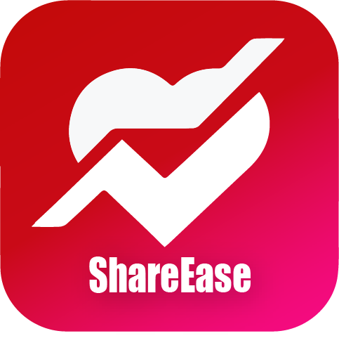

# ShareEase

ShareEase is a community-oriented mobile application designed to simplify resource sharing for the betterment of society. The app focuses on reducing resource wastage by connecting individuals who have surplus resources with those in need, all within a specific location.

## Features

- Easily list surplus resources such as unused food, clothing, and household items.
- No complex sign-up required; users can directly post available items for donation.
- Location-based services to find and connect with available resources nearby.
- Volunteer-friendly: Volunteers can easily locate and coordinate resources for distribution.
- Built using React Native for a user-centric and efficient experience.

## How to Use

1. Download and install the app from the provided link (coming soon).
2. Browse available resources or list your own surplus items for donation.
3. Coordinate with volunteers and beneficiaries to make a positive impact in your community.

## Get Involved

ShareEase is currently in development and will soon be launched. Follow my [LinkedIn profile](https://www.linkedin.com/in/harishkumar023/) for updates on the app's progress and release.

## License

This project is licensed under the [MIT License](licence).
